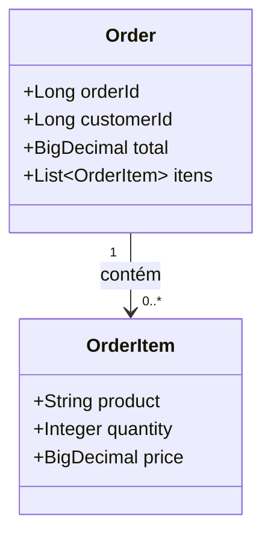
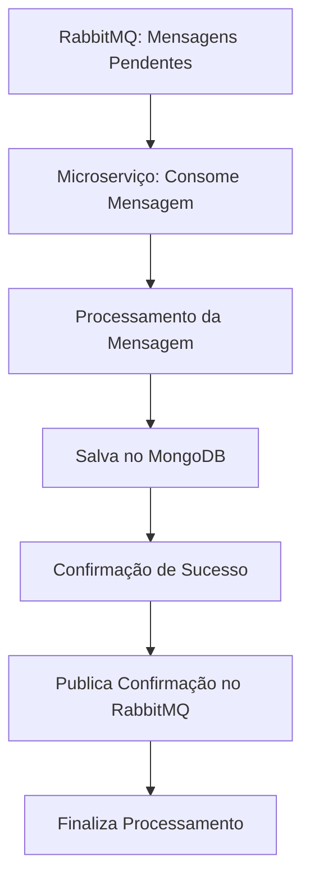

# 📦 Order Service

Documentação do projeto de gerenciamento de pedidos utilizando **MongoDB** e **RabbitMQ**, com representação de modelo via **Mermaid** e ambiente configurado via **Docker Compose**.

---

## 📄 Visão Geral

Este projeto contém:

- Modelos de dados `Order` e `OrderItem` com persistência no MongoDB
- Comunicação assíncrona via RabbitMQ (configurável para eventos)
- Ambiente de desenvolvimento com Docker Compose

---

## 🧾 Diagrama de Classes

## 🔁 Fluxo de Processamento de Mensagens

